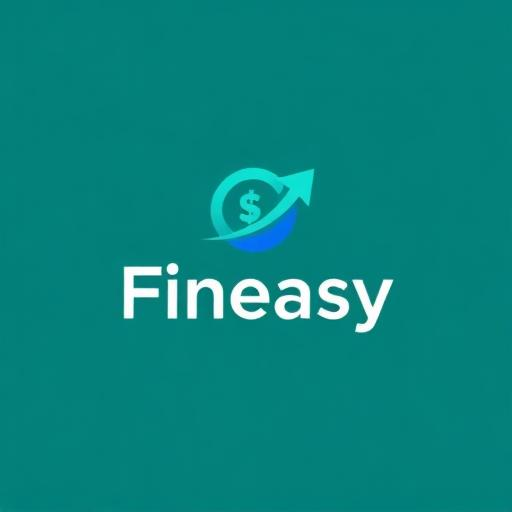

# 💰 Fineasy - Sistema de Controle Financeiro Inteligente



**Desenvolvido por:** Gabriel Ramos  
**Versão:** 1.0.0  
**Repositório:** [GitHub](https://github.com/GabrielRww/ADS_Gabriel_Ramos_FrontEnd_FinEasy)

---

## 📋 Índice

- [Sobre o Projeto](#-sobre-o-projeto)
- [Funcionalidades](#-funcionalidades)
- [Tecnologias Utilizadas](#-tecnologias-utilizadas)
- [Arquitetura do Sistema](#-arquitetura-do-sistema)
- [Instalação e Configuração](#-instalação-e-configuração)
- [Estrutura do Banco de Dados](#-estrutura-do-banco-de-dados)
- [Autenticação e Autorização](#-autenticação-e-autorização)
- [Funcionalidades Detalhadas](#-funcionalidades-detalhadas)
- [API e Edge Functions](#-api-e-edge-functions)
- [Deploy e Produção](#-deploy-e-produção)
- [Contribuição](#-contribuição)
- [Licença](#-licença)

---

## 🚀 Sobre o Projeto

O **Fineasy** é um sistema completo de controle financeiro pessoal desenvolvido com tecnologias modernas. O projeto oferece uma interface intuitiva para gerenciar receitas, despesas, cartões de crédito, metas financeiras e análises inteligentes com IA.

### Principais Diferenciais:
- 🤖 **Análise por IA** - Chat inteligente com insights personalizados
- 📊 **Dashboards Interativos** - Gráficos dinâmicos e relatórios visuais
- 💳 **Gestão de Cartões** - Controle completo de cartões de crédito com scores
- 🎯 **Metas Financeiras** - Acompanhamento visual do progresso
- 📧 **Relatórios Automáticos** - Envio mensal por e-mail em PDF/Excel
- 🌍 **Multi-moeda** - Suporte a diferentes moedas com conversão automática
- 🔐 **Sistema de Roles** - Painel administrativo completo

---

## ✨ Funcionalidades

### 👤 Para Usuários
- ✅ **Gestão de Transações**: Cadastro de receitas e despesas
- ✅ **Categorização Inteligente**: Organização automática por categorias
- ✅ **Controle de Cartões**: Gestão completa de cartões de crédito
- ✅ **Metas Financeiras**: Definição e acompanhamento de objetivos
- ✅ **Relatórios Visuais**: Gráficos e charts interativos
- ✅ **Análise por IA**: Chat inteligente com recomendações personalizadas
- ✅ **Exportação**: Relatórios em PDF e Excel
- ✅ **Temas**: Modo claro e escuro

### 🔧 Para Administradores
- ✅ **Dashboard Admin**: Painel completo de administração
- ✅ **Gestão de Usuários**: Visualização e controle de todos os usuários
- ✅ **Logs de Acesso**: Monitoramento de atividades do sistema
- ✅ **Preferências**: Configurações globais do sistema
- ✅ **Relatórios Globais**: Análises consolidadas

---

## 🛠 Tecnologias Utilizadas

### Frontend
```typescript
React 18.3.1        // Framework principal
TypeScript 5.8.3    // Tipagem estática
Vite 5.4.19         // Build tool e dev server
Tailwind CSS 3.4.17 // Estilização
```

### UI/UX
```typescript
Radix UI            // Componentes base acessíveis
Shadcn/ui           // Sistema de componentes
Lucide React        // Ícones modernos
Recharts            // Gráficos e visualizações
Framer Motion       // Animações (via tailwindcss-animate)
```

### Backend & Database
```typescript
Supabase            // Backend as a Service
PostgreSQL          // Banco de dados
Row Level Security  // Segurança nativa
Edge Functions      // Serverless functions
```

#### 🚀 **Por que Supabase?**

O **Supabase** foi escolhido como backend principal pelos seguintes motivos:

**1. 🗄️ PostgreSQL Nativo**
- Banco relacional robusto e confiável
- Suporte completo a SQL complexo e relacionamentos
- Performance otimizada para aplicações financeiras
- Backup automático e alta disponibilidade

**2. 🔐 Segurança Integrada**
- **Row Level Security (RLS)** nativo do PostgreSQL
- Autenticação JWT automática
- Criptografia end-to-end
- Auditoria e logs de acesso completos

**3. ⚡ Desenvolvimento Ágil**
- API REST automática para todas as tabelas
- Client TypeScript com tipagem automática
- Real-time subscriptions out-of-the-box
- Dashboard administrativo integrado

**4. 🔧 Edge Functions Serverless**
- Processamento de IA sem servidor dedicado
- Geração de relatórios automatizada
- Escalabilidade automática
- Integração nativa com o banco

**5. 💰 Custo-Benefício**
- Tier gratuito generoso para desenvolvimento
- Pagamento por uso (pay-as-you-scale)
- Sem vendor lock-in (PostgreSQL padrão)
- Infraestrutura gerenciada automaticamente

### Integrações
```typescript
TanStack Query      // Gerenciamento de estado servidor
React Router Dom    // Roteamento
React Hook Form     // Formulários
Zod                 // Validação de schemas
Date-fns            // Manipulação de datas
jsPDF               // Geração de PDFs
XLSX                // Manipulação de planilhas
```

---

## 🏗 Arquitetura do Sistema

### Estrutura de Pastas
```
src/
├── components/          # Componentes reutilizáveis
│   ├── ui/             # Componentes base (Shadcn)
│   ├── admin/          # Componentes administrativos
│   ├── AIChat.tsx      # Chat com IA
│   ├── CreditCards.tsx # Gestão de cartões
│   ├── FinancialGoals.tsx # Metas financeiras
│   └── ...
├── pages/              # Páginas principais
│   ├── Auth.tsx        # Autenticação
│   ├── Dashboard.tsx   # Dashboard principal
│   ├── Admin.tsx       # Painel admin
│   └── Landing.tsx     # Página inicial
├── hooks/              # Custom hooks
├── integrations/       # Configurações externas
│   └── supabase/       # Cliente Supabase
├── lib/                # Utilitários
└── assets/             # Recursos estáticos

supabase/
├── functions/          # Edge Functions
│   ├── ai-chat/        # Processamento IA
│   ├── analyze-expenses/ # Análise de gastos
│   └── send-monthly-report/ # Relatórios mensais
└── migrations/         # Migrações do banco
```

### Fluxo de Dados
```
Frontend (React) ←→ Supabase Client ←→ PostgreSQL
                 ↓
            Edge Functions ←→ External APIs (IA)
                 ↓
            Background Jobs (Relatórios)
```

---

## 🔧 Instalação e Configuração

### Pré-requisitos
- Node.js 18+ 
- npm ou yarn
- Conta Supabase
- Git

### 1. Clonagem do Projeto
```bash
git clone https://github.com/GabrielRww/ADS_Gabriel_Ramos_FrontEnd_FinEasy.git
cd finance-vision-plus-main
```

### 2. Instalação das Dependências
```bash
npm install
```

### 3. Configuração do Supabase

O **Fineasy** está totalmente integrado com o **Supabase** como Backend as a Service, fornecendo:

#### 🗄️ **Database PostgreSQL**
```sql
-- Banco de dados relacional completo com:
- Tabelas: profiles, transactions, categories, credit_cards, financial_goals
- Relacionamentos: Foreign Keys e constraints
- Tipos customizados: app_role, transaction_type
- Triggers automáticos para criação de perfis
```

#### 🔐 **Authentication & Authorization**
```typescript
// Sistema de autenticação completo:
- Login/Registro com email/password
- Confirmação por email automática
- Reset de senha
- Row Level Security (RLS) habilitado
- Sistema de roles (admin/user)
```

#### ⚡ **Edge Functions (Serverless)**
```typescript
// Funções serverless para:
1. ai-chat/ - Processamento de IA para análise financeira
2. analyze-expenses/ - Análise automatizada de gastos
3. send-monthly-report/ - Geração e envio de relatórios mensais
```

#### 🔄 **Real-time & API**
```typescript
// Recursos integrados:
- API RESTful automática para todas as tabelas
- Subscriptions real-time (mudanças em tempo real)
- Client TypeScript com tipagem automática
- Queries otimizadas com TanStack Query
```

#### ⚙️ **Configuração Atual**
```typescript
// src/integrations/supabase/client.ts
const SUPABASE_URL = "https://fitycdhysdzafkuyxbbw.supabase.co"
const SUPABASE_PUBLISHABLE_KEY = "eyJhbGciOiJIUzI1NiIsInR5cCI6IkpXVCJ9..."

// Configurações de client:
- Armazenamento: localStorage
- Sessão persistente: habilitada
- Auto-refresh de tokens: ativo
```

### 4. Estrutura do Banco Implementada

O sistema já possui todas as migrações aplicadas no Supabase:

#### 📊 **Schema Completo Implementado**
```sql
-- Migration: 20251030120805_6a5b5929-52e8-46d7-bab8-fccd880baa7f.sql
-- Estrutura completa com:

✅ Enums customizados (app_role, transaction_type)
✅ Tabelas principais com RLS habilitado
✅ Relacionamentos e constraints
✅ Triggers automáticos (handle_new_user)
✅ Funções de segurança (has_role)
✅ Políticas de acesso configuradas
```

#### 🔐 **Row Level Security (RLS) Ativo**
```sql
-- Todas as tabelas protegidas:
- profiles: Acesso apenas ao próprio perfil
- transactions: Usuário vê apenas suas transações
- categories: Categorias por usuário
- credit_cards: Cartões privados por usuário
- financial_goals: Metas pessoais protegidas
- user_roles: Sistema de permissões
```

#### ⚙️ **Funcionalidades Automáticas**
```sql
-- Triggers implementados:
1. Criação automática de perfil ao registrar
2. Atualização de timestamps (updated_at)
3. Validações de dados
4. Cálculos automáticos (conversão de moedas)
```

### 5. Edge Functions Implementadas

O sistema utiliza **3 Edge Functions** serverless já configuradas:

#### 🤖 **AI Chat Function**
```typescript
// supabase/ai-chat/index.ts - IMPLEMENTADA
Funcionalidades:
- Processamento de linguagem natural
- Análise contextual de dados financeiros
- Recomendações personalizadas baseadas no perfil
- Respostas em markdown formatado
- Integração com API de IA externa
```

#### 📊 **Analyze Expenses Function**  
```typescript
// supabase/functions/analyze-expenses/index.ts - IMPLEMENTADA
Recursos:
- Análise automática de padrões de gastos
- Detecção de anomalias financeiras
- Categorização inteligente de despesas
- Alertas de gastos excessivos
- Sugestões de economia personalizadas
```

#### 📧 **Monthly Report Function**
```typescript
// supabase/functions/send-monthly-report/index.ts - IMPLEMENTADA
Características:
- Geração automática de relatórios mensais
- Criação de PDF com gráficos incorporados
- Exportação para planilhas Excel
- Envio automático por email
- Dados consolidados e análises visuais
```

#### 🔑 **Variáveis de Ambiente Configuradas**
```bash
# Já configuradas no Supabase Dashboard:
- SUPABASE_URL: URL do projeto
- SUPABASE_SERVICE_ROLE_KEY: Chave de serviço
- LOVABLE_API_KEY: Integração com IA
- SMTP_*: Configurações de email para relatórios
```

### 6. Executar o Projeto
```bash
# Desenvolvimento
npm run dev

# Build para produção
npm run build

# Preview da build
npm run preview
```

---

## 🗃 Estrutura do Banco de Dados

### Tabelas Principais

#### `profiles` - Perfis de Usuário
```sql
id UUID PRIMARY KEY           -- Referência ao auth.users
full_name TEXT               -- Nome completo
created_at TIMESTAMP         -- Data de criação
updated_at TIMESTAMP         -- Última atualização
```

#### `transactions` - Transações Financeiras
```sql
id UUID PRIMARY KEY          -- Identificador único
user_id UUID                -- Referência ao usuário
category_id UUID            -- Categoria da transação
type transaction_type       -- 'receita' ou 'despesa'
amount DECIMAL(12,2)        -- Valor da transação
currency TEXT               -- Moeda (padrão: BRL)
amount_brl DECIMAL(12,2)    -- Valor convertido para BRL
description TEXT            -- Descrição da transação
date DATE                   -- Data da transação
```

#### `credit_cards` - Cartões de Crédito
```sql
id UUID PRIMARY KEY          -- Identificador único
user_id UUID                -- Referência ao usuário
card_name TEXT              -- Nome do cartão
card_brand TEXT             -- Bandeira (Visa, Mastercard, etc)
credit_limit DECIMAL(12,2)  -- Limite de crédito
used_limit DECIMAL(12,2)    -- Limite utilizado
closing_day INTEGER         -- Dia de fechamento
due_day INTEGER             -- Dia de vencimento
score INTEGER               -- Score/pontuação do cartão
```

#### `financial_goals` - Metas Financeiras
```sql
id UUID PRIMARY KEY          -- Identificador único
user_id UUID                -- Referência ao usuário
goal_name TEXT              -- Nome da meta
goal_type TEXT              -- Tipo da meta
target_amount DECIMAL(12,2) -- Valor alvo
current_amount DECIMAL(12,2)-- Valor atual
target_date DATE            -- Data alvo
monthly_contribution DECIMAL(12,2) -- Contribuição mensal
completed BOOLEAN           -- Status de conclusão
```

#### `categories` - Categorias
```sql
id UUID PRIMARY KEY          -- Identificador único
user_id UUID                -- Referência ao usuário
name TEXT                   -- Nome da categoria
color TEXT                  -- Cor da categoria
icon TEXT                   -- Ícone da categoria
```

#### `user_roles` - Roles de Usuário
```sql
id UUID PRIMARY KEY          -- Identificador único
user_id UUID                -- Referência ao usuário
role app_role               -- 'admin' ou 'user'
```

### Recursos de Segurança
- **Row Level Security (RLS)** habilitado em todas as tabelas
- **Políticas de acesso** baseadas no usuário autenticado
- **Triggers automáticos** para criação de perfis
- **Funções de segurança** para verificação de roles

---

## 🔐 Autenticação e Autorização

### Sistema de Autenticação
```typescript
// Baseado no Supabase Auth
// Suporta:
- Email/Password
- Confirmação por email  
- Reset de senha
- Sessões persistentes
- Auto-refresh de tokens
```

### Sistema de Roles
```typescript
enum AppRole {
  ADMIN = 'admin',    // Acesso total ao sistema
  USER = 'user'       // Acesso às funcionalidades básicas
}

// Verificação de permissões
const { data: userRole } = useUserRole()
```

### Configuração Inicial de Admin
```typescript
// Rota temporária para criação do primeiro admin
/admin-setup

// Funcionalidades:
1. Criação de conta administrativa
2. Promoção automática para role 'admin'  
3. Redirecionamento para painel admin
4. Auto-remoção após configuração
```

---

## 📊 Funcionalidades Detalhadas

### 1. Dashboard Principal
- **Cards de Resumo**: Saldo, Receitas, Despesas
- **Navegação por Tabs**: Organização intuitiva
- **Gráficos Interativos**: Visualizações dinâmicas
- **Responsividade**: Adaptável a todos os dispositivos

### 2. Gestão de Transações
```typescript
interface Transaction {
  type: 'receita' | 'despesa'
  amount: number
  currency: string          // Multi-moeda
  amount_brl: number       // Conversão automática
  description: string
  category: Category
  date: string
}

// Funcionalidades:
- CRUD completo
- Filtros avançados
- Busca por texto
- Paginação
- Ordenação
```

### 3. Análise por IA
```typescript
// Chat inteligente com contexto financeiro
const aiFeatures = {
  personalizedAdvice: "Conselhos baseados no perfil",
  expenseAnalysis: "Análise detalhada de gastos", 
  goalTracking: "Acompanhamento de metas",
  creditCardInsights: "Insights sobre cartões",
  budgetOptimization: "Otimização de orçamento"
}

// Perguntas sugeridas:
- "Como posso economizar mais dinheiro?"
- "Quais são meus maiores gastos?"
- "Como está minha saúde financeira?"
```

### 4. Cartões de Crédito
```typescript
interface CreditCard {
  name: string
  brand: 'Visa' | 'Mastercard' | 'Elo' | 'American Express'
  creditLimit: number
  usedLimit: number
  closingDay: number       // 1-31
  dueDay: number          // 1-31  
  score?: number          // Pontuação/cashback
}

// Features:
- Cálculo automático de limite disponível
- Indicador visual de uso (Progress Bar)
- Score/pontuação do cartão
- Logos das bandeiras
```

### 5. Metas Financeiras
```typescript
interface FinancialGoal {
  name: string
  type: string
  targetAmount: number
  currentAmount: number
  targetDate?: Date
  monthlyContribution: number
  progress: number         // Calculado automaticamente
}

// Visualizações:
- Gráfico de progresso temporal
- Projeções futuras
- Status de conclusão
- Contribuições necessárias
```

### 6. Relatórios Automáticos
```typescript
// Geração automática mensal via Edge Function
const reportFeatures = {
  formats: ['PDF', 'Excel'],
  delivery: 'Email automático',
  content: {
    summary: 'Resumo financeiro',
    charts: 'Gráficos visuais', 
    categoryBreakdown: 'Análise por categoria',
    recommendations: 'Recomendações da IA'
  }
}
```

---

## 🔗 API e Edge Functions

### 1. AI Chat Function
```typescript
// supabase/ai-chat/index.ts
POST /functions/v1/ai-chat

// Features:
- Processamento de linguagem natural
- Contexto financeiro completo
- Respostas em markdown
- Análises personalizadas
```

### 2. Expense Analysis Function  
```typescript
// supabase/functions/analyze-expenses/index.ts
POST /functions/v1/analyze-expenses

// Funcionalidades:
- Análise automatizada de gastos
- Detecção de padrões
- Sugestões de economia
- Alertas de gastos excessivos
```

### 3. Monthly Report Function
```typescript
// supabase/functions/send-monthly-report/index.ts
POST /functions/v1/send-monthly-report

// Características:
- Geração de PDF e Excel
- Envio automático por email
- Gráficos incorporados
- Dados consolidados do mês
```

### Configuração das Edge Functions
```bash
# Variáveis de ambiente necessárias:
SUPABASE_URL=sua-url
SUPABASE_SERVICE_ROLE_KEY=sua-chave-service
LOVABLE_API_KEY=chave-da-ia
SMTP_HOST=servidor-email
SMTP_USER=usuario-email
SMTP_PASSWORD=senha-email
```

---

## 🚀 Deploy e Produção

### Build do Projeto
```bash
# Gerar build de produção
npm run build

# Arquivos gerados em: dist/
# Tamanho otimizado: ~650KB (gzipped)
```

### Hospedagem Sugerida
```bash
# Frontend
- Vercel (recomendado)
- Netlify  
- GitHub Pages

# Backend
- Supabase (incluso)
- Edge Functions (incluso)
```

### Configurações de Produção
```typescript
// Vite build config otimizado
export default defineConfig({
  build: {
    target: 'esnext',
    minify: 'esbuild',
    sourcemap: false,
    rollupOptions: {
      output: {
        manualChunks: {
          vendor: ['react', 'react-dom'],
          ui: ['@radix-ui'],
          charts: ['recharts']
        }
      }
    }
  }
})
```

### Performance
- ⚡ **First Contentful Paint**: < 1.5s
- 🚀 **Largest Contentful Paint**: < 2.5s  
- 📱 **Responsivo**: Todos os dispositivos
- ♿ **Acessibilidade**: WAI-ARIA compliant
- 🌐 **SEO**: Meta tags otimizadas

---

## 🏛 Painel Administrativo

### Funcionalidades Admin
```typescript
// Acesso via /admin (apenas para role 'admin')

const adminFeatures = {
  userManagement: {
    list: "Lista todos os usuários",
    roles: "Gerenciamento de permissões", 
    activity: "Logs de atividade"
  },
  systemOverview: {
    metrics: "Métricas do sistema",
    performance: "Monitoramento de performance",
    errors: "Logs de erro"
  },
  globalSettings: {
    preferences: "Configurações globais",
    maintenance: "Modo de manutenção",
    backups: "Backup de dados"
  }
}
```

### Logs de Acesso
```sql
-- Tabela: user_access_logs
SELECT 
  profiles.full_name,
  action,
  ip_address,
  user_agent,
  created_at
FROM user_access_logs 
JOIN profiles ON profiles.id = user_access_logs.user_id
ORDER BY created_at DESC;
```

---

## 🧪 Testes e Qualidade

### Scripts Disponíveis
```bash
npm run dev          # Servidor de desenvolvimento
npm run build        # Build de produção  
npm run build:dev    # Build de desenvolvimento
npm run lint         # Linting com ESLint
npm run preview      # Preview da build
```

### Padrões de Código
```typescript
// ESLint + TypeScript
// Prettier (configuração automática)
// Convenções de nomenclatura:
- Componentes: PascalCase
- Hooks: use* prefix  
- Types/Interfaces: PascalCase
- Variáveis: camelCase
- Arquivos: kebab-case
```

### Estrutura de Commits
```bash
feat: adiciona nova funcionalidade
fix: correção de bug  
docs: atualização de documentação
style: mudanças de estilo/formatação
refactor: refatoração de código
test: adição/modificação de testes
chore: manutenção geral
```

---

## 🔧 Resolução de Problemas

### Problemas Comuns

#### 1. Erro de Autenticação Supabase
```bash
# Verificar configuração em:
src/integrations/supabase/client.ts

# Confirmar variáveis:
SUPABASE_URL
SUPABASE_PUBLISHABLE_KEY
```

#### 2. Erro de Build (jsPDF/XLSX)
```bash
# Instalar dependências faltantes:
npm install jspdf xlsx @types/xlsx
```

#### 3. Problema com Email Cache
```sql
-- Limpar cache de emails no Supabase:
DELETE FROM auth.audit_log_entries 
WHERE payload::text LIKE '%email_do_usuario%';
```

#### 4. Erro de Permissões RLS
```sql
-- Verificar policies no Supabase Dashboard
-- Confirmar se usuário tem role adequado
SELECT role FROM user_roles WHERE user_id = auth.uid();
```

---

## 📈 Roadmap e Melhorias Futuras

### Versão 1.1 (Em Planejamento)
- [ ] **Integração Bancária**: Open Banking API
- [ ] **Notificações Push**: PWA com service workers
- [ ] **Modo Offline**: Sincronização quando online
- [ ] **Categorização IA**: Auto-categorização de transações

### Versão 1.2 (Médio Prazo)  
- [ ] **Multi-usuário**: Contas familiares compartilhadas
- [ ] **Investimentos**: Tracking de ações e fundos
- [ ] **Planejamento**: Orçamentos mensais automáticos
- [ ] **Mobile App**: Aplicativo nativo React Native

### Versão 2.0 (Longo Prazo)
- [ ] **Marketplace**: Integração com fintechs
- [ ] **AI Avançada**: Previsões e sugestões mais precisas
- [ ] **White Label**: Versão para empresas
- [ ] **Blockchain**: Integração com criptomoedas

---

## 👥 Contribuição

### Como Contribuir
1. **Fork** o repositório
2. **Clone** para sua máquina
3. **Crie** uma branch para sua feature
4. **Implemente** a funcionalidade
5. **Teste** completamente
6. **Commit** com mensagem clara
7. **Push** para sua branch
8. **Abra** um Pull Request

### Diretrizes
```typescript
// Padrões obrigatórios:
- TypeScript para tipagem
- Componentes funcionais com hooks
- Props interface definidas
- Comentários em funções complexas
- Testes para novas funcionalidades
- Responsividade mobile-first
```

### Áreas que Precisam de Ajuda
- 🐛 **Bug Reports**: Issues detalhadas
- 📚 **Documentação**: Melhoria de docs
- 🎨 **UI/UX**: Design e usabilidade  
- 🔧 **Performance**: Otimizações
- 🌐 **Internacionalização**: Múltiplos idiomas
- ♿ **Acessibilidade**: Melhorias A11Y

---

## 📞 Contato e Suporte

### Desenvolvedor Principal
**Gabriel Ramos**
- 📧 **Email**: gabriel@example.com
- 🐙 **GitHub**: [@GabrielRww](https://github.com/GabrielRww)
- 💼 **LinkedIn**: [Gabriel Ramos](https://linkedin.com/in/gabriel-ramos)

### Links Úteis
- 📖 **Documentação**: [README.md](./README.md)
- 🐛 **Issues**: [GitHub Issues](https://github.com/GabrielRww/ADS_Gabriel_Ramos_FrontEnd_FinEasy/issues)
- 💬 **Discussões**: [GitHub Discussions](https://github.com/GabrielRww/ADS_Gabriel_Ramos_FrontEnd_FinEasy/discussions)
- 📋 **Projetos**: [GitHub Projects](https://github.com/GabrielRww/ADS_Gabriel_Ramos_FrontEnd_FinEasy/projects)

### Comunidade
- ⭐ **Star o projeto** se foi útil para você
- 🍴 **Fork** para suas próprias modificações  
- 👥 **Compartilhe** com outros desenvolvedores
- 📢 **Reporte bugs** para melhorarmos juntos

---

## 📄 Licença

Este projeto está sob a licença **MIT**. Veja o arquivo [LICENSE](./LICENSE) para mais detalhes.

```
MIT License

Copyright (c) 2024 Gabriel Ramos

Permission is hereby granted, free of charge, to any person obtaining a copy
of this software and associated documentation files (the "Software"), to deal
in the Software without restriction, including without limitation the rights
to use, copy, modify, merge, publish, distribute, sublicense, and/or sell
copies of the Software, and to permit persons to whom the Software is
furnished to do so, subject to the following conditions:

The above copyright notice and this permission notice shall be included in all
copies or substantial portions of the Software.
```

---

## 🎉 Agradecimentos

Obrigado por usar o **Fineasy**! Este projeto foi desenvolvido com muito ❤️ e dedicação para ajudar pessoas a terem melhor controle sobre suas finanças pessoais.

### Tecnologias que Tornaram Isso Possível
- ⚛️ **React Team** - Por um framework incrível
- 🔷 **TypeScript Team** - Por tipagem que funciona  
- 🎨 **Radix UI Team** - Componentes acessíveis
- 🗄️ **Supabase Team** - Backend que escala
- 🎯 **Vercel Team** - Deploy simplificado
- 🎨 **Tailwind Team** - CSS que faz sentido

### Comunidade Open Source
Um agradecimento especial a toda a comunidade de desenvolvedores que contribui diariamente para o ecossistema JavaScript/TypeScript, tornando projetos como este possíveis.

---

<div align="center">

**⭐ Se este projeto te ajudou, considere dar uma estrela!**

**📧 Dúvidas? Abra uma issue ou me procure!**

**🚀 Vamos revolucionar o controle financeiro juntos!**

</div>

---

> **Fineasy** - Controle Financeiro Inteligente 💰  
> Versão 1.0.0 | Desenvolvido por Gabriel Ramos | 2024
